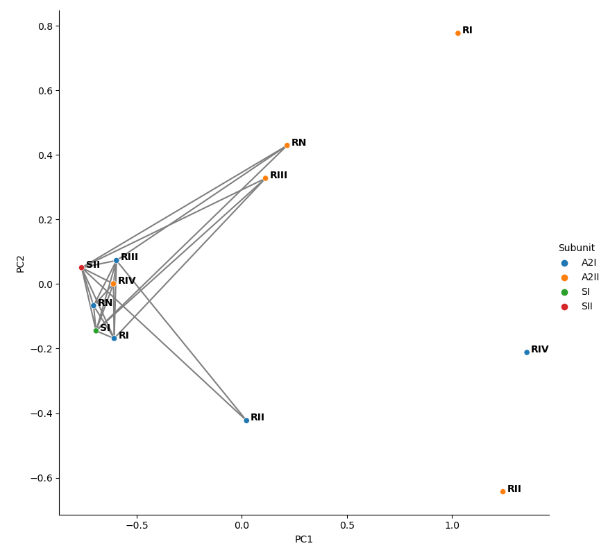
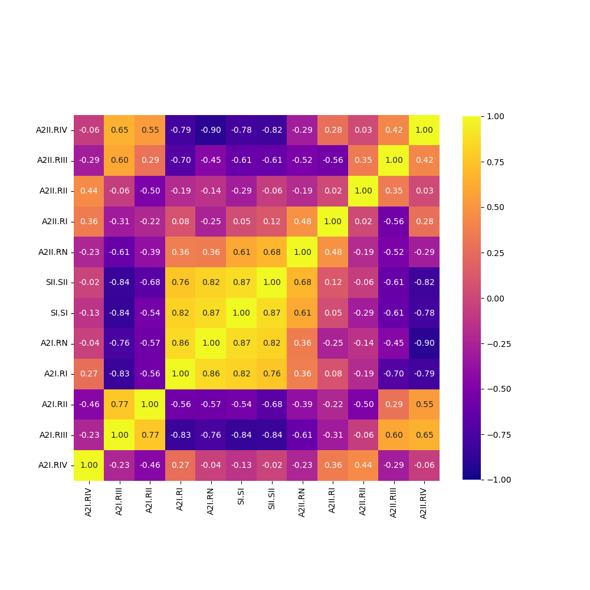

# Correlation Wizard

## Description
Generates feature-space and heatmap plots for subunits of 
molecular structures.

Examples of the two types of plots that are generated are found below.

### Feature-Space Plot


### Correlation Heatmap


## Dependencies

I built this using python 3.6

``` python
pytraj
matplotlib
numpy
pandas
seaborn
sys
os
argparse
sklearn
scipy
```

Don't have a yml file but issuing the following commands will generate a suitable conda environment.

``` bash
$ conda create --name <your-name> python=3.6 matplotlib numpy pandas seaborn sys or argparse sklearn scipy
$ conda install -c ambermd pytraj
```

## Run Instructions

When running, activate the conda environment then issue the following:

``` python
python corr_regions.py -h
```

It will give an explaination of the arguments that are required to run the script.


